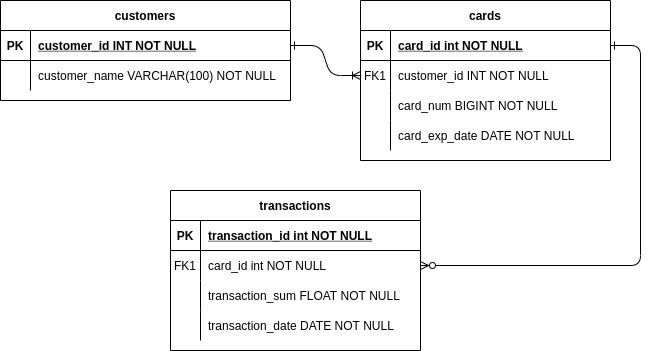

**Задача**

Есть задача создать небольшую транзакционную систему с сущностями "Клиенты", "Карты", "Транзакции".
Клиент владеет одной или несколькими картами, по карте может совершаться одна или более транзакций (операций).
Необходимо спроектировать модель БД (желательно в третьей нормальной форме) и наполнить ее данными (сгенерировать данные), при необходимости создать индексы.
Входными параметрами этой процедуры должны быть "кол-во клиентов" (количество клиентов, которое генерим), "кол-во карт" (количество карт, которое генерим), "кол-во транзакций" (количество операций, которое генерим)

Требования:

Для каждой сущности должен быть создан первичный ключ.

Для клиента должно быть сгенерировано ФИО (либо просто фамилия).

Для карты должен быть сгенерирован номер карты (ЛЮБЫЕ 16 цифр) и дата окончания действия карты (Дата)

Для транзакций обязательными полями являются сумма, тип операции (пополнение, снятие) и дата/время.  Вместо типа операции можно использовать знак плюс или минус у суммы операции

В случае, если после очередной транзакции по карте баланс уходит в минус (то есть суммы предыдущих пополнений не хватает для очередной покупки), то такую транзакцию не вставляем, выводим сообщение (либо записываем куда-нибудь) "недостаточно средств",

В случае совершения операции после даты окончания действия карты - такую транзакцию тоже не вставляем, выводим сообщение - "карта недействительна"

**Решение**

ER-диаграмма проектируемой БД





Для генерирования данных создаем временную таблицу, где будем хранить параметры:

customer_total_number - количество клиентов,

card_total_number - общее количество карт,

transactions_total_number - общее число транзакций.


```sql
CREATE TEMP TABLE vals (val_id TEXT PRIMARY KEY, val INT);
INSERT INTO vals(val_id, val) VALUES
  ('customer_total_number', 50),
  ('card_total_number', 300), 
  ('transactions_total_number', 500);
```

Создаем необходимые функции:

fun_val(\_id text) - вызов значения параметра;

card_exp_date_check(c_id int) - получение срока действия существующей карты по значению card_id;

transaction_sum_check(t_sum double precision, c_id int) - получение остатка на счете карты после транзакции;

generate_names(num int) - генерация имен;

generate_date() - генерация случайной даты;

random_card_num() - генерация случайного номера карты;

random_sum() - генераций случайной суммы транзакции;

random_from_customer_id() - получение случайного существующего значения customer_id;

random_from_card_id() - получение случайного существующего значения card_id;

fill_transactions(c_id INT, t_sum FLOAT, t_date DATE) - функция для заполнения таблицы transactions случайными данными с выводом сообщений "недостаточно средств" или "карта недействительна", если после очередной транзакции по карте баланс уходит в минус или в случае совершения операции после даты окончания действия карты соответственно. Также происходит запись в таблицу **errors**.

```sql
CREATE OR REPLACE FUNCTION fill_transactions(c_id INT, t_sum FLOAT, t_date DATE)
RETURNS VOID AS $$
	begin
		if (transaction_sum_check(t_sum, c_id) < 0) then 
			RAISE INFO 'недостаточно средств';
	    	INSERT INTO errors (msg, detail) VALUES ('недостаточно средств', CONCAT(c_id,'; ', t_sum,'; ', t_date));
	    	RETURN;
		elsif (card_exp_date_check(c_id) <  t_date) then
			RAISE INFO 'карта недействительна';
			INSERT INTO errors (msg, detail) VALUES ('карта недействительна', CONCAT(c_id,', ', t_sum,'; ', t_date));
			RETURN;
		end IF;
		INSERT INTO public.transactions(card_id, transaction_sum, transaction_date)
		values (c_id, t_sum, t_date);
	end;
  $$ LANGUAGE plpgsql;
```

Создаем таблицы. Для cards_id в таблице transactions имеет смысл создать **INDEX**

```sql
CREATE TABLE public.customers (
customer_id SERIAL PRIMARY KEY,
customer_name VARCHAR(100) NOT NULL);


CREATE TABLE public.cards (
card_id SERIAL PRIMARY KEY,
customer_id INTEGER NOT NULL REFERENCES public.customers(customer_id),
card_num BIGINT NOT NULL,
card_exp_date DATE NOT NULL,
CONSTRAINT card_num_positive_num CHECK (card_num > 0),
CONSTRAINT card_num_length CHECK (LENGTH(CAST(card_num AS TEXT)) = 16)
);


CREATE TABLE public.transactions (
transaction_id SERIAL PRIMARY KEY,
card_id INTEGER NOT NULL REFERENCES public.cards(card_id),
transaction_sum FLOAT NOT NULL,
transaction_date DATE NOT NULL,
CONSTRAINT transactions_sum_not_negative check (transaction_sum_check(transaction_sum, card_id) >=0),
CONSTRAINT transaction_by_valid_card check (card_exp_date_check(card_id) >=  transaction_date)
);
CREATE INDEX ON public.transactions(card_id);

CREATE TABLE public.errors (
error_id SERIAL,
error_date date default current_date,
msg text,
detail text);
```

Заполняем таблицы генерируемыми данными

```sql
--customers
INSERT INTO public.customers(customer_name)
select generate_names(fun_val('customer_total_number'));

--cards
INSERT INTO public.cards(customer_id, card_num, card_exp_date)
select random_from_customer_id() as customer_id , 
random_card_num() as card_num,
generate_date() as card_exp_date
from generate_series(1, (select fun_val('card_total_number')));

--transactions
select fill_transactions(random_from_card_id(), random_sum(), current_date) -- generate_date()
from generate_series(1, (select fun_val('transactions_total_number')));
```

Смотрим сколько транзакций прошло, а сколько нет

```sql
--SUCCESS transactions
select * from public.transactions;
--transactions with ERROR
select * from public.errors ;
```

код целиком в файле 'final script.sql'

